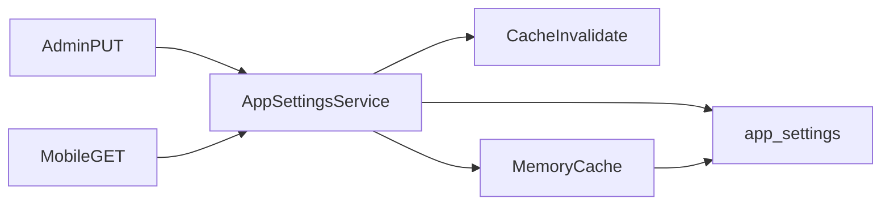

# Global App Settings Management System (Backend)

## Scope

**In scope (this repo):** schema migration, seed catalog, `AppSettingsService`, admin APIs, public mobile API, in-memory server cache, activity logging, API docs.

**Out of scope:** Admin Panel UI, Mobile app caching/UI (document contracts only).

**Preserve existing behavior:** Do not change checkout/booking/OTP/auth flows to _require_ new settings. Keep reading `convenience_fee` / home stats the same way (optionally via the new service as a thin wrapper). Secrets already in `app_settings` (`razorpay_*`, `s3_*`) must never appear on the public mobile endpoint.

---

## Current state

[`app_settings`](src/database/schema.sql) already exists:

```sql
key VARCHAR(100) UNIQUE, value TEXT, description TEXT, updated_by, updated_at
```

Seeded keys include `support_phone`, `otp_expiry_minutes`, `max_upload_size_mb`, etc. Consumers today:

- Checkout: `getAppSettingByKey("convenience_fee")` in [`checkout.controller.ts`](src/controllers/checkout.controller.ts)
- Home stats: `getAppSettingsByKeys` in [`home.controller.ts`](src/controllers/home.controller.ts)

No admin CRUD yet (documented gap in README / API_DOCUMENTATION).

---

## Data model

Keep **key-value** (no schema change when adding settings). Extend via migration `003_app_settings_management.sql`:

| Column                             | Purpose                                                                                                                                          |
| ---------------------------------- | ------------------------------------------------------------------------------------------------------------------------------------------------ |
| `category` VARCHAR(50)             | `general`, `social`, `support`, `features`, `notifications`, `media`, `booking`, `location`, `security`, `behaviour`, `android`, `ios`, `system` |
| `value_type` VARCHAR(20)           | `string` \| `number` \| `boolean` \| `json` (for typed parse/validate)                                                                           |
| `is_public` BOOLEAN DEFAULT false  | Exposed on `GET /app/settings` when true                                                                                                         |
| `is_editable` BOOLEAN DEFAULT true | Blocks admin edits for dangerous keys (e.g. legacy secrets if kept)                                                                              |

Indexes: `(category)`, `(is_public)`.

**Key naming:** dotted keys, e.g. `android.latest_version`, `feature.booking_enabled`, `general.support_email`.

**Seed catalog (migration INSERT … ON CONFLICT DO UPDATE / DO NOTHING):** all keys from the product brief for Android/iOS versioning, general, social, support, feature flags, notification toggles, media, booking, location, security, behaviour — plus existing keys (`support_*`, `otp_*`, `max_upload_size_mb`, …) backfilled with `category` / `value_type` / `is_public`.

**Public vs private:**

- Public: version fields, store URLs, feature flags, maintenance, support/social URLs, booking limits that mobile needs, media limits (non-sensitive).
- Private/admin-only: anything secret or server-only (`razorpay_key_secret`, `s3_*`, internal prefixes). Mark `is_public = false`, `is_editable = false` for secrets.

Do **not** move live secrets out of env in Phase 1; leave legacy secret keys as non-public/non-editable if present.

---

## Version check (server-assisted)

Mobile calls:

```http
GET /api/v1/app/settings?platform=android&app_version=1.2.0
```

Response includes nested settings **plus** a computed `version_check` object (not stored):

```json
{
  "update_available": true,
  "force_update": false,
  "latest_version": "1.3.0",
  "minimum_version": "1.0.0",
  "store_url": "https://play.google.com/...",
  "message": "A new version is available"
}
```

Rules (semver-ish compare `major.minor.patch`):

1. If `app_version < minimum_supported` **or** `force_update` flag true → `force_update: true`
2. Else if `app_version < latest` → `update_available: true`, `force_update: false`
3. Else → no update

If `platform` / `app_version` omitted, omit `version_check` (still return full public config for web/caching).

---

## API design

### Admin (auth + `requireRole("admin")`)

| Method | Path                       | Behavior                                                                                                                                                                   |
| ------ | -------------------------- | -------------------------------------------------------------------------------------------------------------------------------------------------------------------------- |
| GET    | `/admin/app-settings`      | All settings grouped by `category` (optional `?category=`)                                                                                                                 |
| GET    | `/admin/app-settings/:key` | Single key                                                                                                                                                                 |
| PUT    | `/admin/app-settings`      | Bulk upsert body: `{ settings: { "android.force_update": true, ... } }` or `{ categories: { android: { force_update: true } } }` — implement **flat key map** as canonical |
| PATCH  | `/admin/app-settings/:key` | Single key update                                                                                                                                                          |

Validate per `value_type`. Reject unknown keys unless `allow_new_keys` is false (Phase 1: **only known seeded keys**). Write `activity_logs` (`entity_type = app_setting`) with old/new values. Set `updated_by`. Invalidate cache.

### Mobile / public (no auth)

| Method | Path            | Behavior                                                               |
| ------ | --------------- | ---------------------------------------------------------------------- |
| GET    | `/app/settings` | All `is_public` settings nested by category + optional `version_check` |

Mount at [`src/routes/index.ts`](src/routes/index.ts) as public `/app` (alongside `/home`), not under `/admin`.

**ETag / Cache-Control:** `Cache-Control: public, max-age=60` + weak ETag from settings `updated_at` max — supports mobile refresh without hammering DB.

---

## Service / cache layer



New files (match project style — queries + service + controllers, not a heavy repository abstraction):

| File                                                      | Role                                                    |
| --------------------------------------------------------- | ------------------------------------------------------- |
| `src/database/migrations/003_app_settings_management.sql` | Columns + seed catalog                                  |
| `src/queries/settings.queries.ts`                         | SQL                                                     |
| `src/validators/settings.schema.ts`                       | Zod                                                     |
| `src/services/app-settings.service.ts`                    | Get/group/parse/validate/update, version compare, cache |
| `src/controllers/admin/settings.controller.ts`            | Admin handlers                                          |
| `src/controllers/app-settings.controller.ts`              | Public mobile handler                                   |
| `src/routes/admin/settings.routes.ts`                     | Admin routes                                            |
| `src/routes/app.routes.ts`                                | Public `/app/settings`                                  |

**In-memory cache:** module-level Map + TTL (default 60s) + hard invalidate on any admin write. No Redis in Phase 1.

**Typed getters:** `getString`, `getNumber`, `getBoolean`, `getJson` used by service; existing controllers may keep raw SQL or switch to `getString("convenience_fee")` without behavior change.

---

## Response shape (mobile)

```json
{
  "success": true,
  "data": {
    "general": { "app_name": "...", "support_email": "..." },
    "android": {
      "latest_version": "1.3.0",
      "minimum_supported_version": "1.0.0",
      "force_update": false,
      "update_message": "...",
      "store_url": "..."
    },
    "ios": { "...": "..." },
    "features": { "booking_enabled": true, "maintenance_mode": false },
    "version_check": {
      "update_available": false,
      "force_update": false,
      "store_url": null,
      "message": null,
      "latest_version": "...",
      "minimum_version": "..."
    }
  }
}
```

Strip category prefix from nested keys (`android.force_update` → `android.force_update` stored, nested as `android.force_update` → prefer nested `force_update` under `android`).

---

## Security

- Admin JWT + admin role for mutations.
- Public endpoint only `is_public = true`.
- Zod validation by `value_type` (booleans, non-negative numbers, URL strings where applicable).
- Audit every create/update via existing `activity_logs` pattern used in notifications.

---

## Explicit non-goals (Phase 1)

- Rewiring OTP/booking cancellation/env vars to read from `app_settings` (would change live behavior).
- Admin Panel / Mobile UI.
- Settings change-history UI endpoint (audit rows exist; no `GET /admin/activity-log` unless already requested).
- Redis distributed cache.

---

## Implementation order

1. Migration `003` + `schema.sql` sync + `seed.js` wiring
2. Queries + Zod + typed key catalog constant
3. `app-settings.service.ts` (cache, group, version compare)
4. Admin routes/controller
5. Public `/app/settings`
6. Docs (API_DOCUMENTATION + README); thin-wrap `convenience_fee` read through service only if zero behavior risk
7. Smoke: admin PUT → cache invalidate → public GET + version_check scenarios
