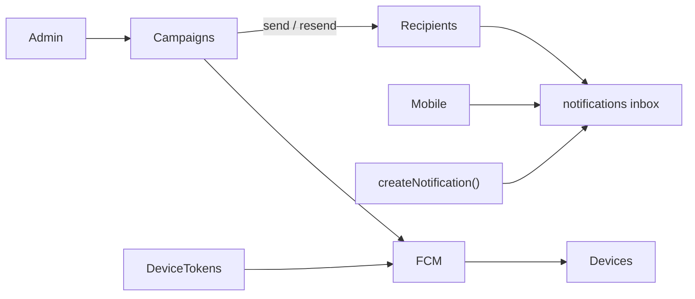
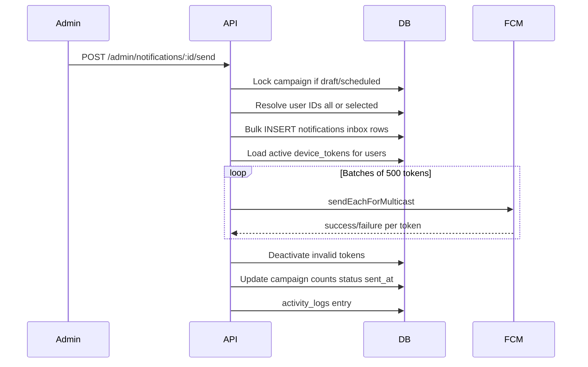

# Notification Management System (Backend)

## Scope (this repo)

**In scope:** PostgreSQL schema/migration, admin REST APIs, mobile user notification APIs, FCM delivery, scheduled sends, audit logging, API documentation updates.

**Out of scope here:** Admin Panel UI and Mobile app UI (separate repos). This plan ships stable API contracts so those teams can integrate in parallel.

**Assumption:** Firebase Admin credentials will be provided via env (service account JSON path or base64). Until set, push send will no-op with a clear log/warning while still writing in-app inbox rows.

---

## Current state to build on

| Existing piece                 | Path                                                                                                                                   | Role                                                                      |
| ------------------------------ | -------------------------------------------------------------------------------------------------------------------------------------- | ------------------------------------------------------------------------- |
| In-app `notifications` table   | [`src/database/schema.sql`](src/database/schema.sql)                                                                                   | Per-user inbox (transactional only today)                                 |
| `createNotification()`         | [`src/services/notification.service.ts`](src/services/notification.service.ts)                                                         | Fire-and-forget INSERT used by pandit/assignment flows                    |
| `device_tokens` + profile APIs | [`001_add_device_tokens.sql`](src/database/migrations/001_add_device_tokens.sql), [`device.queries.ts`](src/queries/device.queries.ts) | FCM/APNs token store — **reuse, do not redesign**                         |
| Admin user list                | `GET /admin/users`                                                                                                                     | Already exists for “selected users” picker                                |
| `activity_logs`                | schema §16                                                                                                                             | Reuse for create/update/send/resend/delete audit                          |
| `node-cron`                    | [`package.json`](package.json)                                                                                                         | Present but unused — use for scheduled campaigns                          |
| S3 upload middleware           | [`src/middleware/upload.ts`](src/middleware/upload.ts)                                                                                 | Reuse for optional notification images (`uploadFolder = "notifications"`) |

There is **no** `firebase-admin`, no push send path, and **no** client `GET /notifications` yet (documented gaps in README / API_DOCUMENTATION).

---

## Data model strategy

Do **not** replace the existing per-user `notifications` inbox. Add a **campaign** layer for admin broadcasts and extend the inbox for delivery/read/click tracking.

### New table: `notification_campaigns` (admin master)

Maps to the plan’s “Notification Table”:

- `id`, `title`, `message`, `image_url`
- `type` (e.g. `promo`, `system`, `announcement` — extendable varchar)
- `target_type`: `all` | `selected` (reserve `group` / `topic` in enum for future)
- `target_user_ids` UUID[] nullable (for `selected`; empty/null for `all` at create; resolved at send)
- `status`: `draft` | `scheduled` | `sending` | `sent` | `cancelled` | `failed`
- `deep_link`, `action_type`, `action_value`
- `scheduled_at`, `sent_at`
- `total_users`, `success_count`, `failed_count`
- `created_by` → `users(id)`, `created_at`, `updated_at`
- Indexes: `(status, scheduled_at)`, `(created_at DESC)`, `(created_by)`

### Extend: `notifications` (user inbox + recipient tracking)

Add columns via migration (keep existing transactional rows working):

- `campaign_id` UUID NULL → `notification_campaigns(id)` ON DELETE SET NULL
- `image_url`, `deep_link`, `action_type`, `action_value`
- `delivery_status`: `pending` | `sent` | `delivered` | `failed` | `skipped` (default `sent` for in-app-only transactional)
- `failure_reason` TEXT
- `delivered_at`, `clicked_at`, `read_at` (derive `is_read` from `read_at IS NOT NULL` or keep `is_read` in sync)
- `deleted_at` TIMESTAMPTZ NULL (soft-delete for mobile “delete / clear history”)
- Indexes: `(user_id, deleted_at, created_at DESC)`, `(campaign_id)`, `(user_id, is_read)` (existing)

**No separate `notification_recipients` table** — inbox rows _are_ recipients. Admin detail “recipient list” = `SELECT * FROM notifications WHERE campaign_id = $1`.

### Device tokens

Keep existing [`device_tokens`](src/database/migrations/001_add_device_tokens.sql) as-is (`token`, `platform`, `is_active`, `last_used_at`). Optional later: `app_version` column — skip in Phase 1.

### Migration delivery

- New file: `src/database/migrations/002_notification_campaigns.sql`
- Wire into [`scripts/seed.js`](scripts/seed.js) (same pattern as `001_add_device_tokens.sql`)
- Mirror DDL into [`schema.sql`](src/database/schema.sql) for fresh installs
- `updated_at` trigger on `notification_campaigns` (match coupons/users pattern)

---

## API design (aligned to existing mount points)

Base: `/api/v1`. Admin routes inherit `authenticate` + `requireRole("admin")` from [`src/routes/index.ts`](src/routes/index.ts).

### Admin — mount at `/admin/notifications`

| Method | Path             | Behavior                                                                                          |
| ------ | ---------------- | ------------------------------------------------------------------------------------------------- |
| POST   | `/`              | Create draft (optional image upload)                                                              |
| GET    | `/`              | List: search, status, target_type, date range, pagination, sort                                   |
| GET    | `/:id`           | Campaign + aggregate counts + paginated recipients                                                |
| PUT    | `/:id`           | Update only if `draft` or `scheduled`                                                             |
| DELETE | `/:id`           | Delete only if `draft`                                                                            |
| POST   | `/:id/send`      | Resolve audience → insert inbox rows → FCM fan-out → mark `sent`                                  |
| POST   | `/:id/resend`    | Clone as new campaign and send (or resend failed only — **default: full resend as new campaign**) |
| POST   | `/:id/duplicate` | Clone to new `draft`                                                                              |
| POST   | `/:id/cancel`    | Cancel if `scheduled`                                                                             |

Reuse existing **`GET /admin/users`** for user picker (no new `/admin/users` endpoint).

### Mobile — mount at `/notifications` (authenticated, any role)

Prefer `/notifications` over `/users/me/notifications` to match existing route style (`/profile`, `/bookings`). Document aliases in API docs if mobile prefers `/users/me/...`.

| Method | Path            | Behavior                                                |
| ------ | --------------- | ------------------------------------------------------- |
| GET    | `/`             | Inbox (exclude soft-deleted), pagination, unread filter |
| GET    | `/unread-count` | Badge                                                   |
| GET    | `/:id`          | Detail (own row only)                                   |
| POST   | `/:id/read`     | Mark read                                               |
| POST   | `/read-all`     | Mark all read                                           |
| POST   | `/:id/click`    | Set `clicked_at` (analytics)                            |
| DELETE | `/:id`          | Soft-delete                                             |
| DELETE | `/`             | Soft-delete all (clear history)                         |

Device token register/list/remove already live under `/profile/device-tokens` — no change required beyond FCM consumption.

---

## Layered file layout (match coupons / types)

| Layer       | New files                                                                                        |
| ----------- | ------------------------------------------------------------------------------------------------ |
| Migration   | `src/database/migrations/002_notification_campaigns.sql`                                         |
| Queries     | `src/queries/notification.queries.ts`                                                            |
| Validators  | `src/validators/notification.schema.ts`                                                          |
| Service     | Extend `src/services/notification.service.ts` + new `src/services/fcm.service.ts`                |
| Controllers | `src/controllers/admin/notification.controller.ts`, `src/controllers/notification.controller.ts` |
| Routes      | `src/routes/admin/notification.routes.ts`, `src/routes/notification.routes.ts`                   |
| Cron        | `src/jobs/notification.cron.ts` (register from `src/server.ts`)                                  |
| Config      | `src/config/firebase.ts` + env keys in [`src/config/env.ts`](src/config/env.ts)                  |
| Docs        | Update [`API_DOCUMENTATION.md`](API_DOCUMENTATION.md), brief README note                         |

Register admin router in [`src/routes/admin/index.ts`](src/routes/admin/index.ts); user router in [`src/routes/index.ts`](src/routes/index.ts) behind `authenticate`.

---

## Send / FCM flow

**Rules:**

1. **Audience:** `all` = active customers (`users` where `status = active` and role customer — match existing user filters); `selected` = provided UUID list validated to exist.
2. **Transactional path:** Keep `createNotification()` writing inbox rows; after FCM lands, optionally call `fcm.service` for that single user (same helper used by campaigns).
3. **Invalid tokens:** On FCM `registration-token-not-registered` / `invalid-argument`, set `device_tokens.is_active = false`.
4. **Large broadcasts:** Process asynchronously after HTTP 202/200 with status `sending` → `sent`/`failed` (in-process batching first; no Redis). Document Bull/Redis as a later scale-out.
5. **Idempotency:** Reject `send` if status is already `sending`/`sent`; use row lock/`FOR UPDATE` on campaign.
6. **Payload data:** `title`, `body`, `image`, `deep_link`, `type`, `action_type`, `action_value`, `notification_id`, `campaign_id`.

**Dependency:** add `firebase-admin`. Env:

- `FIREBASE_PROJECT_ID`
- `FIREBASE_CLIENT_EMAIL`
- `FIREBASE_PRIVATE_KEY` (or `FIREBASE_SERVICE_ACCOUNT_PATH`)

Make Firebase init soft-fail in local/dev when unset so seed/API still work.

---

## Scheduling

- On create/update with `scheduled_at` in the future → status `scheduled`.
- Cron every minute (`node-cron`): select due campaigns (`status = scheduled AND scheduled_at <= NOW()`), run same send pipeline.
- Cancel: `POST /:id/cancel` → `cancelled` (only if still scheduled).

---

## Security & validation

- Admin mutations: existing admin JWT + role.
- Zod schemas for create/update/send body, list query, UUID params.
- Image: reuse `uploadSingle("image")` + S3 folder `notifications`.
- Soft rules: update only draft/scheduled; delete only draft; cancel only scheduled.
- Audit via existing `activity_logs` (`entity_type = notification_campaign`).

---

## Implementation order

1. Migration `002` + schema.sql sync + seed.js wiring
2. Queries + Zod validators
3. FCM config/service (graceful when credentials missing)
4. Extend `notification.service` (create campaign, resolve audience, send pipeline, mark read/click/delete)
5. Admin CRUD + send/resend/duplicate/cancel routes
6. Mobile inbox routes + unread count
7. Wire transactional `createNotification` → optional push
8. Scheduled cron job
9. Update API_DOCUMENTATION.md + README known-gaps
10. Manual smoke: draft → selected send → all send → read/delete → schedule/cancel

---

## Explicit non-goals (Phase 1)

- User groups / topics / city / subscription segments (schema reserves `target_type` values only)
- Admin Panel React screens / Mobile Notification Center UI
- Redis/Bull queue
- WhatsApp delivery
- Separate `notification_recipients` table (inbox rows serve that role)
